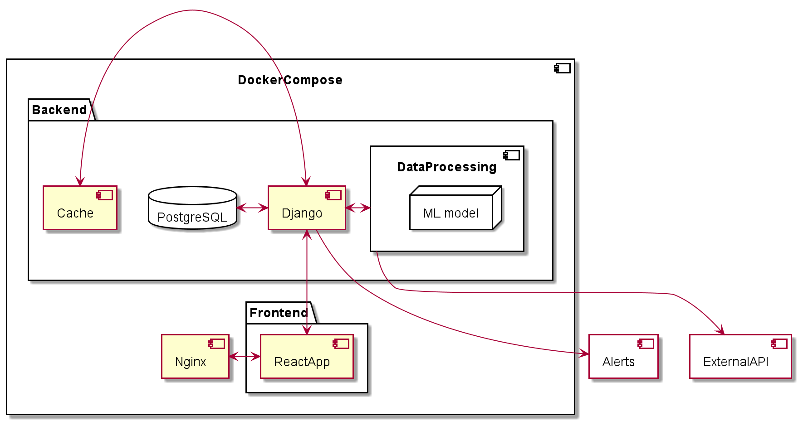

# Описание сервиса
Основной задачей сервиса является поиск фактов утечки на участках нефтепроводов на базе технологий
дистанционного зондирования Земли и алгоритмов машинного обучения.

Проводится оценка площади утечки нефтепродуктов и определяется степень опасности 

для окружающей среды

Визуализация на географической карте выявленных нарушений, ранжирование
их по степени опасности, формирует оперативные и статистические отчеты.

# Архитектура сервиса
Приложение состоит из несколькиз микросервисов, которые запущены в Docker контейнерах. 
Взаимодействие между контейнерами происходит с помощью docker-compose.

В качестве прокси-сервера используется NGINX. 
За клиентскую часть отвечает React приложение.

# Структура базы данных

# Дизайн
https://www.shorturl.at/ptvJT

# Запуск приложения
Скачайте или склонируйте репозиторий.
Для запуска перейдите в основную директорию репозитория.
Из командной строки выполните
- `docker-compose build` 
- `docker-compose up` (с флагом `-d` для запуска в фоновом режиме)
Примерно в течение минуты все сервисы будут запущены и готовы к работе.
Для проверки работы приложения перейдите на http://127.0.0.1/

# КОМАНДА
